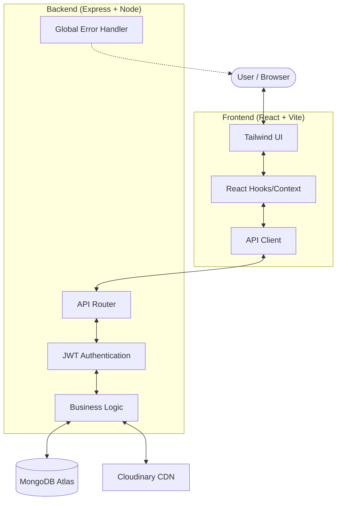
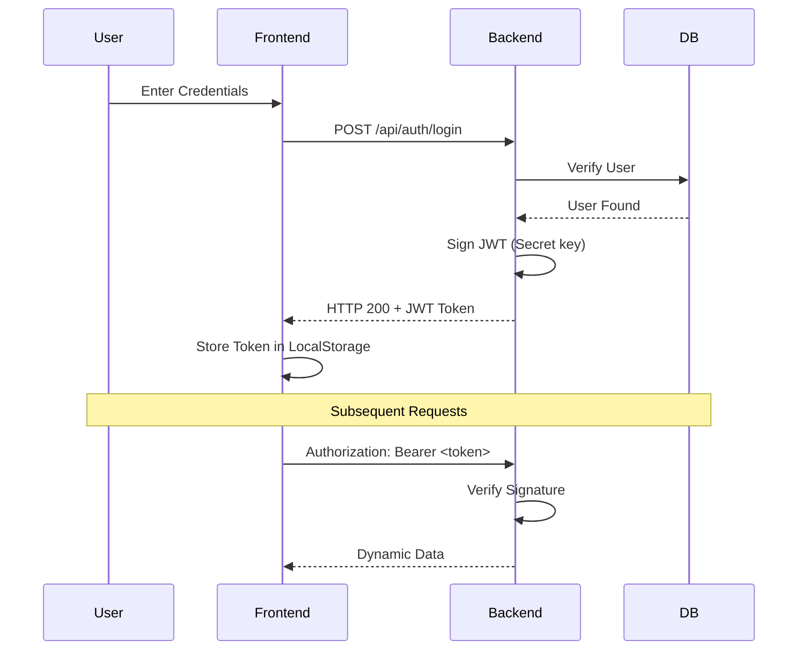
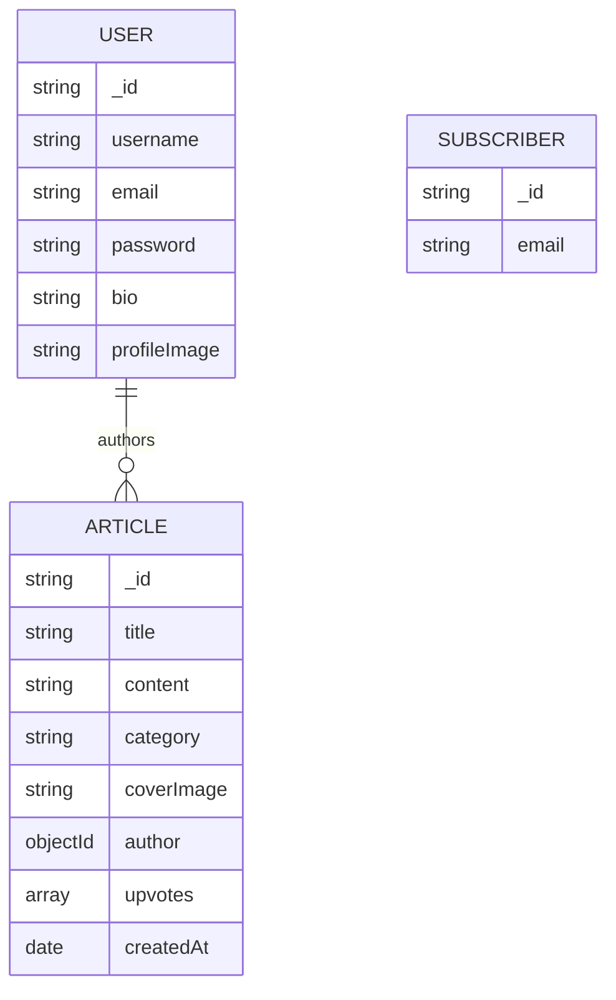

# Novus - Modern Storytelling Platform

[](https://www.mongodb.com/mern-stack)
[](https://cloudinary.com)
[](https://jwt.io)

**Novus** is a production-ready content platform designed for modern storytelling. Built with the MERN stack, it prioritizes security, performance, and a seamless developer experience.

---

## System Architecture

Novus follows a decoupled Client-Server architecture with centralized state management and cloud integration.



---

## Authentication Flow

Secure implementation of Stateless Authentication using JSON Web Tokens (JWT).



---

## Data Model (ERD)

Optimized MongoDB schemas designed for high performance and scalability.



---

## Key Features & Interview Talking Points

### 1. **Stateless Security**
- **JWT & Bcrypt**: Stateless authentication and password hashing.
- **Production Middleware**: Integrated `Helmet` for secure headers and `express-rate-limit` to prevent Brute-Force/DDoS attacks.

### 2. **Cloud-Native Media**
- **Cloudinary Integration**: Direct-to-cloud image uploads with server-side validation, ensuring the database only stores optimized CDN URLs.

### 3. **Developer Experience (DX)**
- **Centralized Error Handling**: A global middleware captures all asynchronous errors, preventing server crashes and returning clean, consistent JSON responses.

### 4. **Modern Frontend Architecture**
- **React 19 Hooks**: Utilizing the latest React features for efficient state management.
- **Code Splitting**: implemented `React.lazy` and `Suspense` for faster initial page loads and reduced bundle sizes.

---

## Tech Stack

- **Frontend**: React 19, Tailwind CSS 4, Vite, Axios, Lucide React.
- **Backend**: Node.js, Express.js (v5), MongoDB (Mongoose), JWT, Cloudinary.
- **Security**: Helmet, Express Rate Limit, Bcrypt, CORS Hardening.
- **Optimization**: Compression (Gzip/Brotli), Code Splitting.

---

## Getting Started

### Prerequisites
- Node.js >= 18.x
- MongoDB (Running locally or via Atlas)

### Setup
1. **Clone the Repo**
   ```bash
   git clone https://github.com/RanaVinit/novus.git
   ```
2. **Backend Configuration**
   ```bash
   cd backend
   cp .env.example .env
   npm install
   npm run dev
   ```
3. **Frontend Configuration**
   ```bash
   cd ../frontend
   npm install
   npm run dev
   ```

---

## Roadmap & Future Enhancements
- [ ] **Unit & Integration Testing**: Implementing Jest and Supertest.
- [ ] **Caching Layer**: Integrating Redis for high-traffic article feeds.
- [ ] **Social Features**: Commenting system and real-time notifications.
- [ ] **CI/CD**: GitHub Actions for automated deployment and quality checks.

---

## License
ISC License. Feel free to use this project for learning or as a foundation for your own platform!