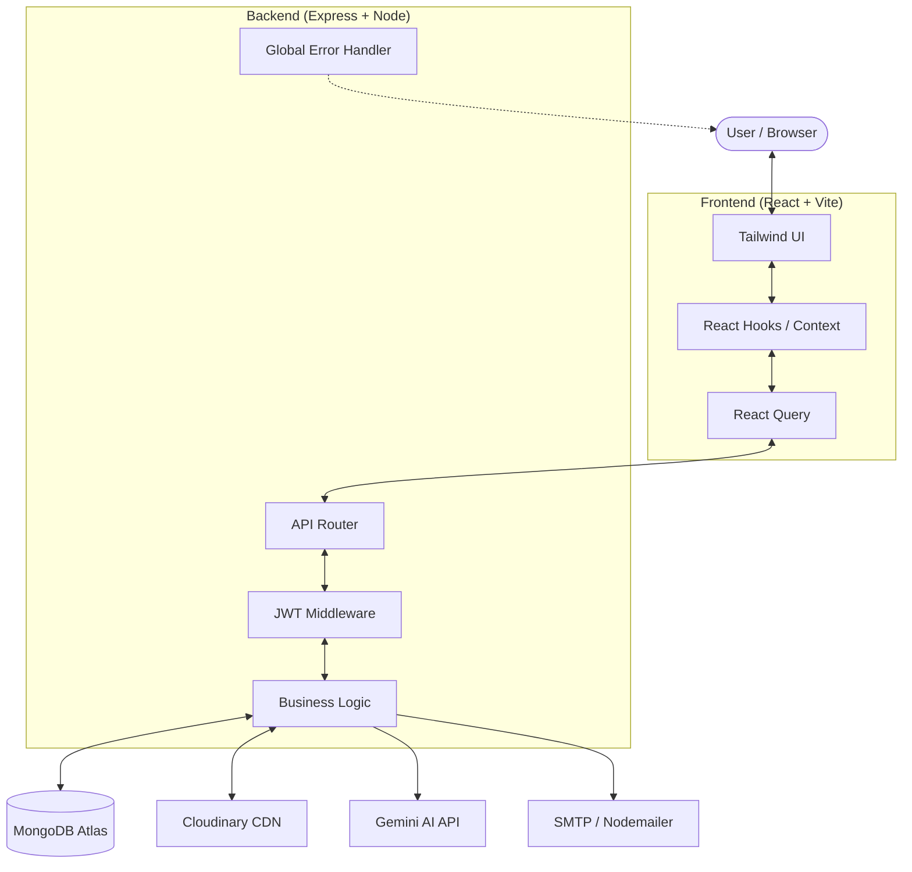
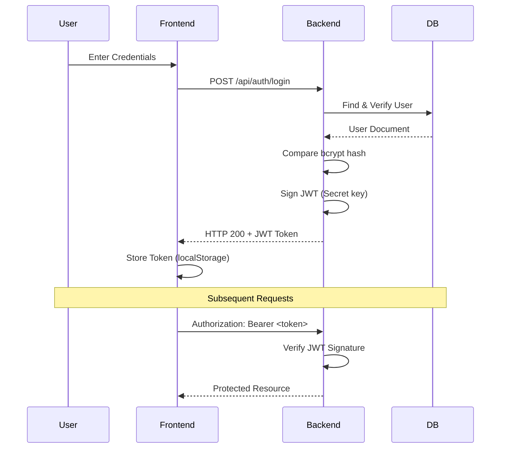
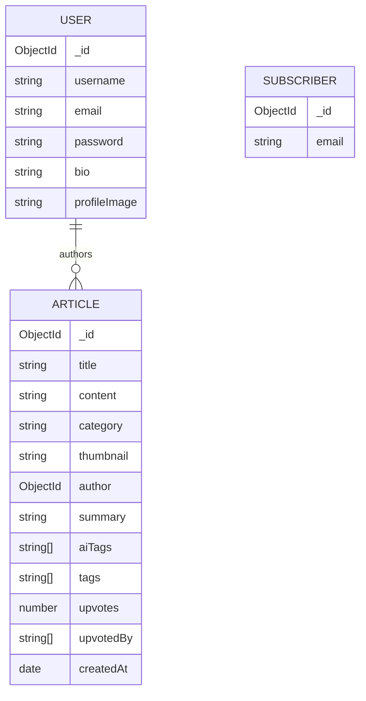

# Novus — Modern Storytelling Platform

<div align="center">

[](https://novus-gamma.vercel.app)
[](https://www.mongodb.com/mern-stack)
[](https://ai.google.dev)
[](https://jwt.io)

**Novus** is a production-ready content platform for modern storytelling. Built with the MERN stack and enhanced with AI-powered content analysis, it prioritizes security, performance, and a seamless developer experience.

</div>

---

## System Architecture

Novus follows a decoupled Client-Server architecture with centralized state management, cloud integration, and AI-enhanced data enrichment.


```mermaid
graph TD
    User([User / Browser])
    subgraph "Frontend (React + Vite)"
        UI[Tailwind UI]
        State[React Hooks / Context]
        RQ[React Query]
    end
    subgraph "Backend (Express + Node)"
        Router[API Router]
        Auth[JWT Middleware]
        Controllers[Business Logic]
        Error[Global Error Handler]
    end
    Gemini[Gemini AI API]
    Cloudinary[Cloudinary CDN]
    Mail[SMTP / Nodemailer]
    DB[(MongoDB Atlas)]

    User <--> UI
    UI <--> State
    State <--> RQ
    RQ <--> Router
    Router <--> Auth
    Auth <--> Controllers
    Controllers <--> DB
    Controllers <--> Cloudinary
    Controllers --> Gemini
    Controllers --> Mail
    Error -.-> User
```

---

## Key Features

### AI-Powered Content Analysis
On every article submission, the backend calls the **Google Gemini 2.5 Flash Lite** model to automatically:
- Generate a compelling **2-sentence TL;DR summary** of the article.
- Extract **3–5 SEO-friendly `aiTags`** — stored directly on the article document for filtering and discoverability.

This is handled entirely server-side in `services/aiService.js`, so the author gets intelligent enrichment with zero extra effort.

### Stateless Security
- **JWT & Bcrypt**: Stateless authentication and password hashing. Tokens are signed server-side; no session state is stored.
- **Helmet**: Sets secure HTTP headers out of the box (XSS protection, HSTS, etc.).
- **Express Rate Limit**: Caps each IP at 100 requests per 15-minute window — preventing brute-force and DDoS attempts.

### Cloud-Native Media
- **Cloudinary Integration**: Images are uploaded directly to Cloudinary. The backend validates the upload server-side and only stores the optimized CDN URL in MongoDB — keeping the database lean.

### Email Newsletter System
- **Nodemailer (SMTP)**: When a user subscribes to the newsletter, a **styled HTML welcome email** is dispatched via `services/mailService.js`.
- The subscriber's email is stored in a dedicated `Subscriber` collection, decoupled from the `User` model.

### Performance & DX
- **Compression**: Gzip/Brotli response compression via the `compression` middleware.
- **MongoDB Aggregation Pipelines**: Used for article feeds with server-side join (`$lookup`), projection (password scrubbing), shuffling (`$sample`), and pagination — avoiding N+1 queries.
- **Code Splitting**: `React.lazy` and `Suspense` reduce the initial JS bundle size for faster first-load times.
- **Centralized Error Handling**: A single global middleware captures all async errors, preventing server crashes and returning clean, consistent JSON error responses with stack traces hidden in production.

---

## Tech Stack

| Layer | Technology |
|---|---|
| **Frontend** | React 19, Vite, Tailwind CSS 4, React Query, React Router v7, Lucide React |
| **Backend** | Node.js, Express.js v5, Mongoose, JWT, Nodemailer |
| **AI** | Google Gemini 2.5 Flash Lite (`@google/genai`) |
| **Media** | Cloudinary |
| **Security** | Helmet, Express Rate Limit, Bcrypt, CORS Hardening |
| **Optimization** | Compression (Gzip/Brotli), Code Splitting, MongoDB Aggregation |
| **Database** | MongoDB Atlas |

---

## Authentication Flow


```mermaid
sequenceDiagram
    participant User
    participant Frontend
    participant Backend
    participant DB

    User->>Frontend: Enter Credentials
    Frontend->>Backend: POST /api/auth/login
    Backend->>DB: Find & Verify User
    DB-->>Backend: User Document
    Backend->>Backend: Compare bcrypt hash
    Backend->>Backend: Sign JWT (Secret key)
    Backend-->>Frontend: HTTP 200 + JWT Token
    Frontend->>Frontend: Store Token (localStorage)
    Note over User,DB: Subsequent Requests
    Frontend->>Backend: Authorization: Bearer <token>
    Backend->>Backend: Verify JWT Signature
    Backend-->>Frontend: Protected Resource
```

---

## Data Model (ERD)


```mermaid
erDiagram
    USER ||--o{ ARTICLE : authors
    USER {
        ObjectId _id
        string username
        string email
        string password
        string bio
        string profileImage
    }
    ARTICLE {
        ObjectId _id
        string title
        string content
        string category
        string thumbnail
        ObjectId author
        string summary
        string[] aiTags
        string[] tags
        number upvotes
        string[] upvotedBy
        date createdAt
    }
    SUBSCRIBER {
        ObjectId _id
        string email
    }
```

> **Note**: The `ARTICLE` schema reflects the full model including AI-enriched fields (`summary`, `aiTags`) added automatically on creation.

---

## API Endpoints

| Method | Endpoint | Auth | Description |
|---|---|---|---|
| `POST` | `/api/auth/register` | N | Register a new user |
| `POST` | `/api/auth/login` | N | Login and receive JWT |
| `GET` | `/api/articles` | N | Fetch article feed (supports `search`, `category`, `shuffle`, `limit`, `skip`) |
| `GET` | `/api/articles/:id` | N | Get single article |
| `POST` | `/api/articles` | Y | Create article (triggers AI analysis) |
| `PUT` | `/api/articles/:id` | Y | Update own article |
| `DELETE` | `/api/articles/:id` | Y | Delete own article |
| `POST` | `/api/articles/:id/upvote` | Y | Upvote an article |
| `POST` | `/api/articles/:id/downvote` | Y | Remove upvote |
| `GET` | `/api/users/:id` | Y | Get user profile |
| `POST` | `/api/subscribe` | N | Subscribe to newsletter (sends welcome email) |
| `GET` | `/api/health` | N | Server health check |

---

## Getting Started

### Prerequisites
- Node.js >= 18.x
- MongoDB (Running locally or via Atlas)
- A [Cloudinary](https://cloudinary.com) account
- A [Google AI Studio](https://aistudio.google.com) API key (for Gemini)
- A Gmail account with App Password enabled (for SMTP)

### Setup

1. **Clone the Repo**
   ```bash
   git clone https://github.com/RanaVinit/novus.git
   cd novus
   ```

2. **Backend Configuration**
   ```bash
   cd backend
   npm install
   ```
   Create a `.env` file with the following keys:
   ```env
   PORT=5000
   MONGO_URI=your_mongodb_connection_string
   JWT_SECRET=your_super_secret_key
   CLOUDINARY_CLOUD_NAME=your_cloudinary_name
   CLOUDINARY_API_KEY=your_cloudinary_key
   CLOUDINARY_API_SECRET=your_cloudinary_secret
   GEMINI_API_KEY=your_google_ai_api_key
   SMTP_USER=your_gmail_address
   SMTP_PASS=your_gmail_app_password
   ```
   ```bash
   npm run dev
   ```

3. **Frontend Configuration**
   ```bash
   cd ../frontend
   npm install
   ```
   Create a `.env` file:
   ```env
   VITE_API_URL=http://localhost:5000
   ```
   ```bash
   npm run dev
   ```

---

## Roadmap & Future Enhancements
- [ ] **Unit & Integration Testing**: Implementing Jest and Supertest for controller and route testing.
- [ ] **Caching Layer**: Integrating Redis for high-traffic article feed caching.
- [ ] **Social Features**: Commenting system and real-time notifications via WebSockets.
- [ ] **CI/CD**: GitHub Actions for automated linting, testing, and deployment.

---

## License
ISC License. Feel free to use this project for learning or as a foundation for your own platform.